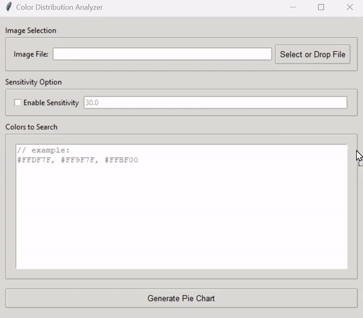

# Color Distribution Analyzer

### Overview
**Color Distribution Analyzer** is a Python-based application that lets users analyze color distributions within an image. By selecting or dragging an image file, users can specify custom colors (in hex format) and adjust sensitivity to identify similar colors in the image. The app generates a pie chart to visually represent the color distribution based on the user's input.

### Key Features
- **Image Selection**: Choose or drag-and-drop an image file.
- **Color Input**: Input colors in hex format (e.g., #FFDF7F, #900DFF).
- **Sensitivity Adjustment**: Fine-tune color matching sensitivity.
- **Pie Chart Visualization**: View a color distribution chart of matching colors within the image.

### Demo


---

### Installation and Usage

#### Run the App

1. **Download the .exe**:
   - Download the latest release from the [Releases page](https://github.com/Glooring/color-distribution-analyzer/releases) or directly using [this link](https://github.com/Glooring/color-distribution-analyzer/releases/download/v1.0.0/Release.zip).

2. **Extract and Run**:
   - Extract the `.zip` file.
   - Double-click `app.exe` to start the application.

3. **Using the Application**:
   - **Open the Application**: Once the app is running, select an image by using the "Select or Drop File" button, or drag and drop an image file directly into the app.
   - **Specify Colors**: Enter colors in hex format (e.g., `#FFDF7F, #900DFF`) to analyze their presence in the image.
   - **Adjust Sensitivity**: Use the sensitivity slider to determine how closely colors in the image should match the specified colors.
   - **Generate Chart**: Click "Generate Pie Chart" to see the color distribution in a pie chart with a legend showing color percentages.

---

#### For Developers

1. **Clone the Repository**:
   ```bash
   git clone https://github.com/Glooring/color-distribution-analyzer.git
   cd color-distribution-analyzer
